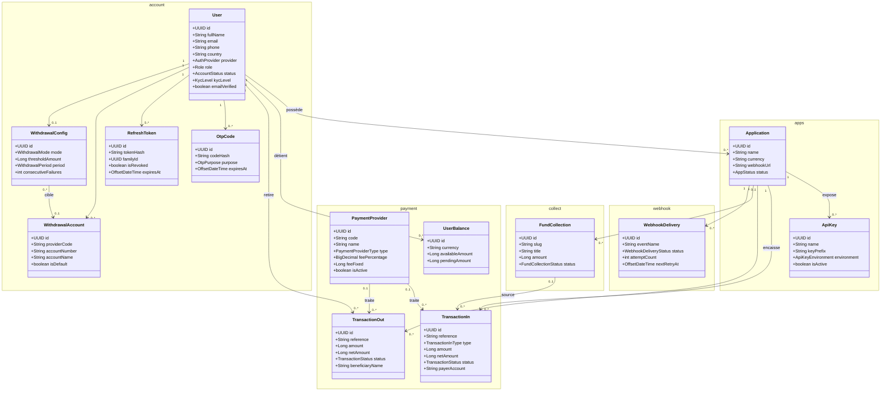

# Diagramme de classes — SharePay Aggregator

Modèle du domaine tel qu'il existe aujourd'hui dans le code : les **13 entités JPA**
du backend et leurs associations, réparties en **5 modules**.

> Toutes les entités portent `id: UUID`, `createdAt` et `updatedAt` — omis ci-dessous
> pour la lisibilité. Les énumérations sont persistées en `EnumType.STRING`.
>
> Relevé des classes `@Entity` de `com.sharepay.aggregator.modules.*` au 17 juillet 2026.

## Modules

| Module | Entités |
|--------|---------|
| **account** | `User` · `OtpCode` · `RefreshToken` · `WithdrawalAccount` · `WithdrawalConfig` |
| **apps** | `Application` · `ApiKey` |
| **payment** | `PaymentProvider` · `TransactionIn` · `TransactionOut` · `UserBalance` |
| **collect** | `FundCollection` |
| **webhook** | `WebhookDelivery` |

Le module `admin` ne définit aucune entité propre : il opère sur `User` filtré par le rôle `MERCHANT`.

## Diagramme

## Points de lecture

- **Deux hubs** structurent le modèle : `User` (le compte) et `Application` (le point d'intégration).
- Les **encaissements** (`TransactionIn`) sont rattachés à l'`Application`, **pas** directement au `User` — d'où le passage par `application.user` dans les requêtes admin.
- Les **retraits** (`TransactionOut`) sont, eux, rattachés directement au `User`.
- `PaymentProvider` est un **référentiel transverse** (MTN / Orange) relié en `0..1` aux deux types de transactions.

## Énumérations (14)

| Énumération | Module | Valeurs |
|-------------|--------|---------|
| `Role` | account | `ADMIN`, `MERCHANT`, `SUPPORT` |
| `AccountStatus` | account | `ACTIVE`, `PENDING_VERIFICATION`, `SUSPENDED`, `DELETED` |
| `KycLevel` | account | `NONE`, `BASIC`, `VERIFIED`, `ADVANCED` |
| `AuthProvider` | account | `LOCAL`, `GOOGLE` |
| `OtpPurpose` | account | `EMAIL_VERIFICATION`, `PASSWORD_RESET` |
| `WithdrawalMode` | account | `MANUAL`, `INSTANT`, `THRESHOLD`, `PERIODIC` |
| `WithdrawalPeriod` | account | `DAILY`, `WEEKLY`, `MONTHLY` |
| `AppStatus` | apps | `ACTIVE`, `SUSPENDED`, `DELETED` |
| `ApiKeyEnvironment` | apps | `LIVE`, `TEST` |
| `PaymentProviderType` | payment | `MOBILE_MONEY`, `BANK_CARD`, `BANK_TRANSFER` |
| `TransactionInType` | payment | `CHECKOUT`, `CHARGE`, `FUND_COLLECTION` |
| `TransactionStatus` | payment | `PENDING`, `SUCCESS`, `FAILED`, `CANCELLED`, `REFUNDED` |
| `FundCollectionStatus` | collect | `ACTIVE`, `CLOSED`, `EXPIRED`, `DELETED` |
| `WebhookDeliveryStatus` | webhook | `PENDING`, `DELIVERED`, `FAILED` |
