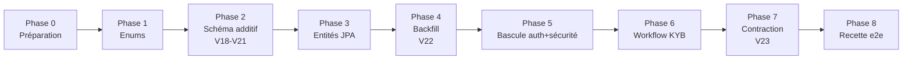

# Plan de migration — Refonte identité / accès (User → User·Merchant·Membership)

Séquence d'implémentation pour passer du modèle actuel (`User` fait tout) au modèle cible
à trois couches + staff granulaire + KYB, **sans casser les comptes existants**.

> **État de départ** (relevé du code au 17 juillet 2026) : dernière migration Flyway = **V17**
> (les nouvelles commencent à **V18**). Surface d'impact mesurée : ~26 usages de
> `User.role`/`kycLevel`, ~28 fichiers touchant une FK `user_id`, ~25 points de sécurité
> (`SecurityConfig.java:76-82` protège par `hasRole`).

---

## Principe directeur : expand / contract

On ne renomme ni ne supprime rien tant que le code lit encore l'ancien modèle. L'ordre est
toujours le même et il est **non négociable** :

1. **Expand** — on *ajoute* tables, colonnes et enums, tout en **nullable/optionnel**. L'ancien code continue de tourner.
2. **Backfill** — on *remplit* le nouveau modèle à partir de l'ancien (grandfathering des comptes existants).
3. **Cutover** — le code *bascule* : il écrit et lit le nouveau modèle.
4. **Contract** — on *retire* l'ancien (colonnes, enums, chemins de code) une fois plus personne ne le lit.

Chaque phase doit **compiler, démarrer et passer les tests** avant la suivante. À aucun
moment la branche n'est dans un état non déployable.

---

## Décisions à verrouiller AVANT de coder

Ces choix changent le contenu des étapes. Recommandations par défaut entre parenthèses.

| # | Décision | Recommandation |
|---|----------|----------------|
| D1 | **Grandfathering** des marchands existants | Les passer `MerchantStatus.ACTIVE`, `verificationLevel` dérivé de l'ancien `kycLevel` (`NONE→NONE`, `BASIC→BASIC`, `VERIFIED→VERIFIED`, `ADVANCED→ADVANCED`). Pas de re-KYB forcé. |
| D2 | **Type** des marchands existants (inconnu en base) | Défaut `INDIVIDUAL` ; bandeau dashboard invitant à compléter le profil société si besoin. |
| D3 | **Stockage objet** pour les documents (prérequis Phase 6) | MinIO en local / S3-compatible en prod. **À provisionner avant la Phase 6** — bloquant pour le KYB. |
| D4 | **Rename physique** `user_balances → merchant_balances` | **Ne pas renommer la table.** Garder `user_balances`, mapper l'entité `MerchantBalance` dessus via `@Table(name="user_balances")`. Évite un rename risqué ; le nom logique change, le physique non. |
| D5 | **Rôle `SUPPORT`** existant | Le convertir en `platformRole=ADMIN` + `StaffPermission` équivalentes (probablement `MERCHANT_VIEW`, `TRANSACTION_VIEW`, `REPORTING_VIEW`). |
| D6 | **Invitations multi-membres** | **Hors périmètre** de cette migration (confirmé par le diagramme cible). On pose `Membership` mais un seul `OWNER` par marchand. |

---

## Phase 0 — Préparation (filet de sécurité)

**But :** pouvoir migrer sans peur et détecter toute régression.

1. Créer une branche dédiée (`refonte/identite-acces`).
2. Établir une **baseline de tests** sur les flux critiques actuels : register/login/refresh, création d'app + clé API, encaissement (PayIn), retrait (PayOut), soldes. Ce sont eux qui doivent rester verts à chaque phase.
3. Sauvegarde de la base + procédure de restauration vérifiée.
4. Figer les **décisions D1–D6** ci-dessus.

**Terminé quand :** la baseline de tests passe et sert de référence.

---

## Phase 1 — Enums (socle sans dépendance)

**But :** poser tout le vocabulaire ; ça compile isolément, aucun impact runtime.

Créer dans `shared/constant/` (ou `modules/account/constant/`) : `PlatformRole`,
`PlatformPermission`, `MerchantType`, `MerchantStatus`, `MerchantRole`, `MembershipStatus`,
`DocumentType`, `DocumentStatus`, `VerificationLevel`. Dans `apps` : `ApiScope`.
Étendre `OtpPurpose` avec `LOGIN_MFA`.

> On **ne touche pas encore** à `Role`/`KycLevel` : ils restent vivants jusqu'à la contraction (Phase 7).

**Terminé quand :** le projet compile (`./mvnw compile`).

---

## Phase 2 — Schéma additif (expand) · migrations V18 → V21

**But :** créer la structure cible en base, **tout nullable**, sans rien casser.

- **V18** — `create table merchants`, `create table memberships` (FK `user_id`, `merchant_id`, `role`, `status`, contrainte d'unicité `(user_id, merchant_id)`).
- **V19** — `create table verification_documents` (FK `merchant_id`, `storage_key`, `checksum_sha256`, `status`, `uploaded_by`, `reviewed_by`…), `create table staff_permissions` (FK `user_id`, `permission`, `granted_by`, unicité `(user_id, permission)`).
- **V20** — `alter table users add platform_role` (nullable), `add mfa_enabled default false` ; `alter table api_keys add scopes`.
- **V21** — `add merchant_id` (**nullable**) à `applications`, `user_balances`, `transactions_out`, `withdrawal_accounts`, `withdrawal_configs`.

> Règle Flyway du projet : ne jamais modifier une migration appliquée ; nommage `V{n}__snake_case.sql`.

**Terminé quand :** l'appli démarre, Flyway applique V18–V21, tous les tests baseline restent verts (le code ignore encore les nouvelles colonnes).

---

## Phase 3 — Entités JPA nouvelles (lecture seule)

**But :** matérialiser le modèle en Java **sans encore l'utiliser** dans les flux.

1. Entités + repositories : `Merchant`, `Membership`, `VerificationDocument`, `StaffPermission`.
2. Sur les entités existantes, ajouter le champ `merchant` (`@ManyToOne`, **optionnel**) **à côté** du champ `user` actuel — les deux coexistent pendant la bascule. Renommer l'entité `UserBalance → MerchantBalance` en la mappant sur la table `user_balances` (cf. D4).

**Terminé quand :** ça compile, démarre, tests baseline verts. Aucun flux n'utilise encore les nouvelles entités.

---

## Phase 4 — Backfill (données existantes) · migration V22

**But :** peupler le nouveau modèle pour tous les comptes déjà là (grandfathering).

Pour chaque `User` avec `role = MERCHANT` :
1. Créer un `Merchant` (`type=INDIVIDUAL` [D2], `status=ACTIVE` [D1], `verificationLevel` dérivé du `kycLevel` [D1]).
2. Créer un `Membership(user, merchant, role=OWNER, status=ACTIVE)`.
3. Renseigner `merchant_id` sur ses `applications`, `user_balances`, `transactions_out`, `withdrawal_accounts`, `withdrawal_configs`.

Pour chaque `User` staff : `role=ADMIN → platform_role=SUPERADMIN` ; `role=SUPPORT → platform_role=ADMIN` + `staff_permissions` équivalentes [D5].

> **Comment :** la partie relationnelle simple peut être en **SQL pur** (V22). La logique dérivée
> (`kycLevel → verificationLevel`, mapping SUPPORT) est plus lisible dans un **runner Java one-shot**
> idempotent (guardé, ex. `@Component` déclenché une fois puis marqué fait) — au choix, mais garder
> l'opération **idempotente et rejouable**.

**Terminé quand :** chaque marchand a exactement 1 `Membership(OWNER)`, 0 ligne `applications/balances/...` avec `merchant_id` NULL, staff correctement classé. Requêtes de contrôle à l'appui.

---

## Phase 5 — Bascule applicative (cutover)

**But :** le code écrit et lit le nouveau modèle. C'est la phase la plus sensible — la découper.

**5a. Onboarding** — `AuthServiceImpl.register()` (actuellement `role=MERCHANT, status=ACTIVE`) crée désormais, dans une transaction : `User` (`status=PENDING_VERIFICATION`) + `Merchant` (`status=PENDING`) + `Membership(OWNER)`. La vérif email passe le `User` en `ACTIVE` ; le `Merchant` reste `PENDING` jusqu'au KYB.

**5b. JWT** — `JwtService.generateAccessToken(...)` évolue : ajouter les claims `active_merchant`, `membership_role`, `scopes`, `platform_role`. Adapter `JwtAuthenticationFilter` pour construire un principal `AuthenticatedUser { userId, activeMerchantId, membershipRole, permissions }`.

**5c. Sécurité** — remplacer le `hasRole` par chemin (`SecurityConfig.java:76-82`) par une autorisation portée par le `Membership` (RBAC) **et** un **gate de capacité** (`MerchantStatus=ACTIVE`) pour les actions sensibles. Les deux verrous sont **orthogonaux** : un `OWNER` sur un marchand `PENDING` ne peut ni encaisser en `LIVE` ni retirer.

**5d. Re-scoping user_id → merchant_id** — migrer les ~28 fichiers **module par module**, en gardant les tests verts entre chaque : `apps` → `payment` (soldes + `TransactionOut`) → `withdrawals`. Les encaissements (`TransactionIn`) **restent** rattachés à l'`Application` (inchangé).

**5e. Clés API** — appliquer les `ApiScope` dans `ApiKeyAuthenticationFilter` + le gate `LIVE`/`TEST`.

**Terminé quand :** register crée les 3 couches, login émet un JWT avec `active_merchant`, toutes les actions passent par RBAC + gate, tests baseline adaptés verts.

---

## Phase 6 — Workflow KYB / KYC (nouvelle fonctionnalité)

**Prérequis : D3 (stockage objet) provisionné.**

1. Upload de `VerificationDocument` → **stockage objet privé** (jamais le binaire en base) ; on ne persiste que `storage_key`, `checksum_sha256`, métadonnées. Accès par **URL pré-signée courte durée** uniquement.
2. Liste des `DocumentType` requis **dérivée du `MerchantType`** (KYC individu / KYB société).
3. Endpoints staff de revue (`KYB_APPROVE` / `KYB_REJECT` + `rejectionReason`), gardés par `PlatformPermission`.
4. **Cascade centrale** : documents `APPROVED` → `verificationLevel` monte (dérivé, pas posé à la main) → au seuil requis, `Merchant` `PENDING → ACTIVE` → capacités débloquées (clés `LIVE`, encaissement réel, retraits).
5. Implémenter les **machines à états** du diagramme cible comme gardes de transition (toute transition non listée = interdite).

**Terminé quand :** un marchand `PENDING` qui fait valider ses documents passe `ACTIVE` automatiquement et débloque le `LIVE`.

---

## Phase 7 — Contraction (contract) · migration V23

**But :** retirer l'ancien modèle, maintenant que plus personne ne le lit.

- **V23** — `merchant_id` passe **NOT NULL** là où requis ; `drop column users.role`, `users.kyc_level` ; nettoyage des restes `SUPPORT`.
- Supprimer côté code : enum `Role`, `KycLevel`, le champ `user` en doublon sur les entités re-scopées, les chemins morts.
- (Rename physique de table : **non**, cf. D4.)

**Terminé quand :** plus aucune référence à `Role`/`kycLevel`/`user_id` sur les tables re-scopées ; `grep` propre ; tests verts.

---

## Phase 8 — Recette de bout en bout

Scénarios à dérouler (idéalement avec le skill `verify` / captures) :
- Onboarding **individu** : register → vérif email → upload pièces → revue staff → `ACTIVE` → clé `LIVE`.
- Onboarding **société** : mêmes étapes avec documents KYB.
- **Gate** : tentative d'encaissement `LIVE` / de retrait sur marchand `PENDING` → refusée ; sandbox `TEST` → autorisée.
- **Staff** : `SUPERADMIN` accorde une permission à un `ADMIN` ; l'`ADMIN` sans `KYB_APPROVE` est refusé sur la revue.
- **Grandfathering** : un ancien compte migré se connecte, retrouve ses apps/soldes/transactions, garde son niveau.

---

## Récap des points à risque

| Risque | Où | Parade |
|--------|-----|--------|
| **Argent** mal re-scopé (soldes/retraits) | Phase 5d, `payment`/`withdrawals` | Migrer module par module, tests baseline PayOut/soldes verts entre chaque |
| **Bascule sécurité** trop large d'un coup | Phase 5c | Introduire le principal + gate d'abord, garder `hasRole` en parallèle, basculer route par route |
| **Backfill non idempotent** | Phase 4 | Opération rejouable + requêtes de contrôle (0 `merchant_id` NULL) |
| **Documents** : binaire en base ou URL exposée | Phase 6 | `storage_key` seulement, URLs pré-signées courtes, jamais loggées |
| **Escalade de privilèges** staff | Phase 5c/6 | Gestion du staff câblée sur `SUPERADMIN`, hors `PlatformPermission` |
